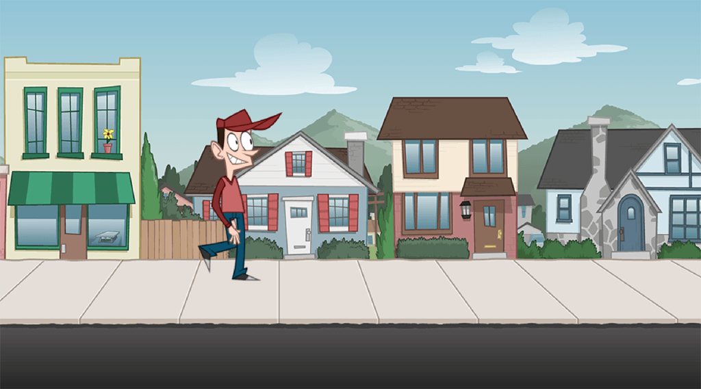

# MelonJS Sprite Sheet Tutorial Source

A simple project showing how to use sprite sheets and animations in MelonJS.

## Tutorial Content

* Learn why you should use sprite sheets in your MelonJS game
* Use TexturePacker to create a sprite sheet
* Optimize the sprite sheet: Faster startup for your game
* Use static images (background)
* Use animations

The complete tutorial is available from here: [MelonJS Sprite Sheet Tutorial](https://www.codeandweb.com/blog/2015/11/08/using-sprite-sheets-with-melonjs-tutorial)

